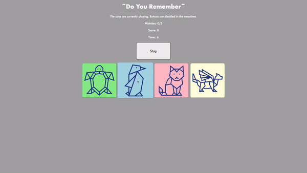

# Pre-work - *Memory Game*

**Memory Game** is a Light & Sound Memory game to apply for CodePath's SITE Program. 

Submitted by: **Derek Li**

Time spent (required functionality): **1.5** hours spent 

Time spent (optional + additional features): **8** hours spent 

Link to project: (insert your link here, should start with https://glitch.com...)

## Required Functionality

The following **required** functionality is complete:

* [x] Game interface has a heading (h1 tag), a line of body text (p tag), and four buttons that match the demo app
* [x] "Start" button toggles between "Start" and "Stop" when clicked. 
* [x] Game buttons each light up and play a sound when clicked. 
* [x] Computer plays back sequence of clues including sound and visual cue for each button
* [x] Play progresses to the next turn (the user gets the next step in the pattern) after a correct guess. 
* [x] User wins the game after guessing a complete pattern
* [x] User loses the game after an incorrect guess

The following **optional** features are implemented:

* [x] Any HTML page elements (including game buttons) has been styled differently than in the tutorial
* [x] Buttons use a pitch (frequency) other than the ones in the tutorial
* [x] More than 4 functional game buttons
* [x] Playback speeds up on each turn
* [x] Computer picks a different pattern each time the game is played
* [x] Player only loses after 3 mistakes (instead of on the first mistake)
* [x] Game button appearance change goes beyond color (e.g. add an image)
* [x] Game button sound is more complex than a single tone (e.g. an audio file, a chord, a sequence of multiple tones)
* [x] User has a limited amount of time to enter their guess on each turn

The following **additional** features are implemented:

- [x] Added a jquery animation for when you first start the game.
- [x] Replays cues after making mistake and it's not game over.
- [x] Show player their score.
- [x] Fixed some bugs related to behavior of the buttons in the origial tutorial 
    - The use of ``onmousedown`` and ``onmouseup`` caused would cause the tone of the button to play forever if you clicked on a button region and whilst holding the mouse down moved the cursor off the button region.
    - Buttons still registered as guesses as they were still enabled during ``playClueSequence`` which may not have been the intended behavior of the game.  
    - Made it clear when the cue was playing and when the user should and shouldn't press the buttons.
- [x] Added a custom favicon.

## Video Walkthrough (GIF)

If you recorded multiple GIFs for all the implemented features, you can add them here:

Introduction and losing by time.

Losing by mistakes.

Winning and showing that the speed of clues gets faster.

## Reflection Questions
1. If you used any outside resources to help complete your submission (websites, books, people, etc) list them here. 

- For understanding various Web APIs (setTimeout, setInterval, etc): https://developer.mozilla.org/en-US/docs/Web/API
- For better understanding HTML: https://www.w3schools.com/html/default.asp
- For better understanding CSS: https://www.w3schools.com/css/default.asp
- For better understanding JS: https://www.w3schools.com/js/default.asp
- For button icons: https://www.flaticon.com/

2. What was a challenge you encountered in creating this submission (be specific)? How did you overcome it? (recommended 200 - 400 words) 

The primary challenge was understanding the flow of game logic to make modifications to its base functionality. This is due to the game’s reliance on user decision making. The asynchronous behavior between the playing of cues and user input, places much emphasis on perspectives of both the player and the programmer.

This leads to the first set of technical challenges: implementation of any feature that changed the game logic. We first established the behavior of the game with HTML buttons and Javascript functions like startGame, stopGame, guess, playClueSequence and more.  For each additional implementation we had to consider which functions to modify and whether to use any Web APIs. 

For example, when implementing mistake tracking, we added a global mistakes variable, updated HTML elements, and implemented the loss condition in the guess function. Though not technically challenging, logically it was hard to determine which code to modify. Thus, it isn’t just the implementation of keeping track of mistakes that was important, but also understanding how we want the player and game to behave after a mistake is made. 

From this we determine that game knowledge and player behavior are two primary areas of interest. The challenge is similarly twofold. Specifically, as programmers, how can we best express information so that the player can clearly understand the game’s behavior? Subsequently, how do we account for the cases when the player behaves in an unexpected manner?

In the initial construction of the game, we call guess(btn) for each button on any button click. This means that if the game was active, the buttons were active. This in addition to various setTimeout and setInterval led to interesting behavior where cues would be simultaneously playing, various HTML elements would be updating out of order, all because the user could press buttons anytime, even when the cues are playing. 

The technical challenge was then to figure out of to effectively disable and reenable buttons by invoking setTimeout correctly and communicating to the user the intended behavior. This was done by updating some HTML elements and creating helper functions disableButtons and enableButtons. They were then called each time the cues were played in playClueSequence. 

Overall, overcoming many of these obstacles stemmed primarily either from mapping out logic or reading documentation and understanding the languages better and testing from a user’s perspective and taking the role of both the programmer and user.

The primary challenge in creating this submissoin was to best understand the flow of logic in the game to properly make any desired modifications. 

3. What questions about web development do you have after completing your submission? (recommended 100 - 300 words) 

The primary question of consideration is how to increase complexity to create more dynamic web-based products. In this project we used HTML, CSS, and Javascript, each contained in one file. However, understanding the vast availability of open source libraries and frameworks (like jQuery), how do we start building more dynamic webpages, web apps, web-based games and more. 

Stemming from this relatively abstract question leads to some more questions:

1.	Considering that access to the web is not restricted to just a computer. How do we ensure that in addition to this increase in complexity, products behave as expected across all platforms?
2.	Recognizing that coding is highly collaborative and relatively complex, what are the best practices for developing web products? Both in coding practices in general, but also the standard for industry.
3.	At what point can someone consider their web app or web page a finished product? Similarly considering the difference between a small project like this memory game and anything created for a professional purpose.
4.	More technically speaking, when we develop web products, what are ways to expand past using HTML, CSS, and JavaScript? In other words, what other languages can be used, and what features might they provide? How can we incorporate domains of Computer Science programming such as Machine Learning, Data Visualization, Databases, Networks, or more?

Overall, the desire is to just better understand web development as a whole and employ programming in a way that is both novel and robust. By doing so we can learn about web-development in a way that is both enjoyable to create web-based products as a programmer yet also comfortable to consume as a user.

4. If you had a few more hours to work on this project, what would you spend them doing (for example: refactoring certain functions, adding additional features, etc). Be specific. (recommended 100 - 300 words) 

Though in its most basic form this game is very effective as a memory game, if I had a few more hours to work on this project I would like to improve the user experience in both functionality and aesthetic.

I have started incorporating some beginnings of this with the jQuery animations, the difficulty selection buttons and the “play again” option after the game ends; however, I would like to make more comprehensive game start and end menus in addition to a more diverse game difficulty selection and customizability. 

Specific features to implement would be the following:
-	The option to choose the pattern length or even have an unbounded pattern length. Though there would not technically be a win condition in the infinite case, but we can then keep track of a highscore variable in this case. Updating whether the current score is greater than a previously tracked high score.
-	Incorporate additional difficulty by unrestricting the number of buttons that can be generated (there would have to be some refactoring done here in the Javascript to more efficiently generate buttons in the HTML file)
-	An option to reveal and conceal the images on the button to adjust game difficulty
-	An option to mute and unmute the audio to adjust game difficulty
-	Understanding the WebAudio API better by including background music for start and end menus
-	More types of animations, whether that be with jQuery or other available libraries.

In order to implement these various functionalities, I would attempt to refactor the code into game states similarly to how we have startGame and stopGame where various global variables are reassigned to where it may be best to encapsulate the different states of the game with startMenu, endMenu functions.

## Interview Recording URL Link

[My 5-minute Interview Recording](your-link-here)

## License

    Copyright Derek Li

    Licensed under the Apache License, Version 2.0 (the "License");
    you may not use this file except in compliance with the License.
    You may obtain a copy of the License at

        http://www.apache.org/licenses/LICENSE-2.0

    Unless required by applicable law or agreed to in writing, software
    distributed under the License is distributed on an "AS IS" BASIS,
    WITHOUT WARRANTIES OR CONDITIONS OF ANY KIND, either express or implied.
    See the License for the specific language governing permissions and
    limitations under the License.
